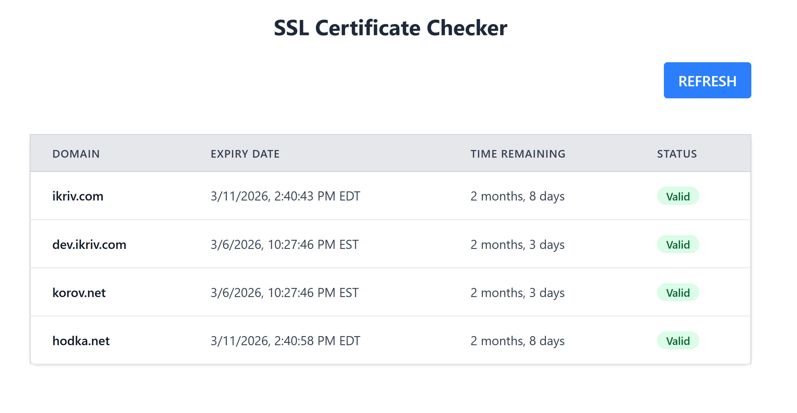

# SSL Certificate Checker

## Motivation

[Let's Encrypt is ending support for expiration notification emails](https://letsencrypt.org/2025/01/22/ending-expiration-emails) on June 4, 2025. I vibe-coded the solution to this problem relatively quick, but I only got to "productionize" it now. This project provides:

- A command-line tool to check certificate expiration
- An email alert script for cron-based monitoring  
- A web dashboard for visual monitoring



## Quick Start: Manual Cert Check

Check certificate expiration from the command line (no dependencies required). This should work on any operating system that supports Python. Don't forget to use backslash instead of slash on Windows.

```bash
cd server/core
python check_cert.py google.com github.com example.com
```

## Cron Setup: Email Alerts

`check_sert_email.py` script sends expiration alerts via email. It relies on `/usr/bin/sendmail` and thus would work only on Linux and perhaps Mac if `sendmail` is installed. There is no `sendmail` on Windows. You can run this script periodically (e.g. daily) using `cron`, again, only on Linux.

### 1. Create Configuration File

```bash
cp server/core/config.example.ini server/core/config.ini
```

Edit `server/core/config.ini`:

```ini
[email]
from = alerts@yourdomain.com
to = admin@yourdomain.com

[alerts]
# Send alerts when certificate expires in these many days
warning_days = 30,14,7,1

[domains]
list = yourdomain.com, api.yourdomain.com, mail.yourdomain.com
```

### 2. Test the Script

We provide a script named `cronjob` inside `server/core` that invokes `check_cert_email.py`. You can temporarily add `--force` to make it send an email every time it is run. It redirects the output to `check_cert_email.log`.

```bash
cd server/core
./cronjob
```

### 3. Add to Cron

```bash
crontab -e
```

Add (adjust path to your installation):

```cron
# Check SSL certificates daily at 8 AM
0 8 * * * /path/to/server/core/cronjob
```

## Web Dashboard Deployment

The web dashboard runs as a Docker container. Apache or Nginx acts as a reverse proxy, forwarding requests to the container.

### 1. Configure Environment

Create `frontend/.env.local` with the following settings:

```bash
# Base path for the dashboard URL (e.g., /certs for https://yourdomain.com/certs/)
NEXT_PUBLIC_BASE_PATH=/certs

# Domains to monitor (semicolon-separated)
NEXT_PUBLIC_DOMAINS_TO_CHECK=yourdomain.com;api.yourdomain.com;mail.yourdomain.com
```

**Important:** `NEXT_PUBLIC_BASE_PATH` must match the path in your reverse proxy configuration. If you serve the dashboard at `/certs/`, set `NEXT_PUBLIC_BASE_PATH=/certs`. For root deployment, leave it empty or omit it.

**Note:** These variables are embedded at build time. If you change them later, you must rebuild the frontend (`cd frontend && npm run build`) and restart Docker.

### 2. Start the Docker Container

```bash
# Build frontend first
cd frontend && npm install && npm run build && cd ..

# Start the server
docker-compose up -d
```

The container runs on port 5000.

### 3. Configure Reverse Proxy for Apache

Configure your web server to forward requests to the Docker container. Below is the guide for Apache, since this is the web server I use. If you use a different web server, refer to its do documentation. If your web server runs in a docker container, the parts related to shared network are still applicable.

#### Prerequisites

Apache requires `mod_proxy` and `mod_proxy_http` modules. Enable them with:

```bash
a2enmod proxy proxy_http
systemctl restart apache2
```

#### Configuring Standalone Apache

If Apache runs at the system level, i.e. not in a Docker container, add the following to your Apache virtual host (the path must match `NEXT_PUBLIC_BASE_PATH`):

```apache
# SSL Certificate Checker at /certs/
ProxyPass /certs/ http://127.0.0.1:5000/
ProxyPassReverse /certs/ http://127.0.0.1:5000/
```

#### Configuring Apache in a Docker Container

If Apache runs in a Docker container, you cannot use `127.0.0.1` since Apache and the cert-checker are in separate containers. Instead, create a shared Docker network.

In cert-ui `docker-compose.yml`, uncomment the networks block:

```
services:
  backend:
    ...
    networks:
      - shared-network

networks:
  shared-network:
    name: shared-network   
```

You can also comment out the "ports" block, since we no longer need to export port 5000 to the hots computer.

Add similar code to your Apache's `docker-compose.yml`. Assuming Apache runs in a container named "webserver", it would look like this:

```
services:
  webserver:
     ...
     networks:
       - default
       - shared-network
networks:
  shared-network:
    name: shared-network

```

After these changes, Apache "webserver" container and cert checker "certs-ui" container run on the same network and can communicate between each other by name.

Add the following to your Apache virtual web host configuration:

```bash
ProxyPass /certs/ http://certs-ui:5000/
ProxyPassReverse /certs/ http://certs-u:5000/
```

After these steps, the dashboard will be available at `https://yourdomain.com/certs/`.

## Development Setup

### Backend

```bash
cd server
python -m venv .venv
source .venv/bin/activate  # Windows: .venv\Scripts\activate
pip install -r requirements.txt
python app.py
```

Backend runs on `http://localhost:3000`.

### Frontend

```bash
cd frontend
npm install
npm run dev
```

Frontend runs on `http://localhost:5000` and proxies API requests to the backend.

**Note:** Both servers must be running for the web dashboard to work in development.

## API

```bash
# Single domain
curl "http://localhost:5000/api/?domain=google.com"

# Multiple domains  
curl "http://localhost:5000/api/?domains=google.com,github.com"

# Streaming (for many domains)
curl -H "Accept: application/x-ndjson" "http://localhost:5000/api/?domains=google.com,github.com"
```
